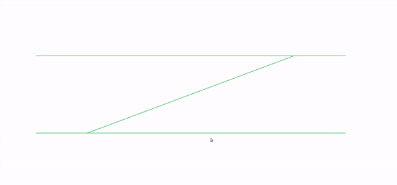

# trainNetwork
A two dimensional simulation of trains depicted as point particles which are added interactively to a simple train network comprising of three train rails. 

The simulation shows that no matter how many trains are added, the network is smart enough to bring train to train collisions to a complete halt and avoid casualties.
